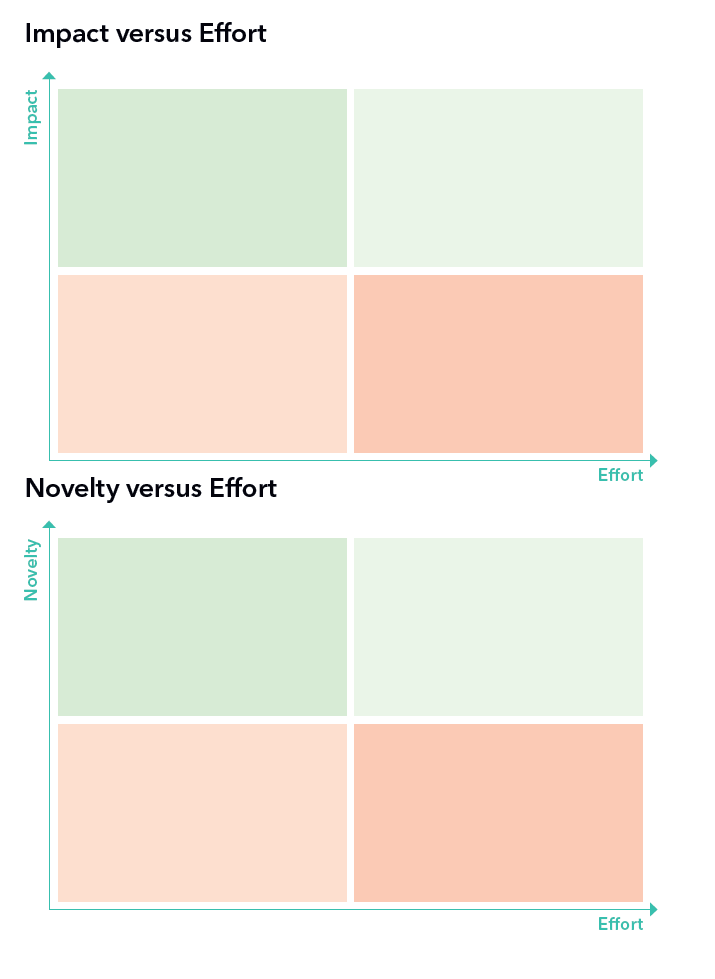

### Refining

This is a free form section where you boil down the themes and keywords from the [brainstorming](../brainstorming) down to one theme for your next tech talk.
We suggest 10 minutes for doing this. 

Some tools you may use: 

#### Impact vs Effort graphs or Novelty vs Effort graphs 

You can consider where your theme fits in the four quads of the graphs 
* Impact - refers to how much the theme will help achieve your goal 
* Novelty - sometimes a theme with a high novelty factor could be preferred 

Something in the green quads might be more prefereable to something in the req quads

#### Some helpful questions

1. If there are very few keywords:
  *	Which keyword are you most excited about? 
  *	Can you combine any 2-3 random keywords?
  *	Can you compare/contrast some keywords?

2. If there are a lot of keywords 
  *	What is the theme you care the most about 
  * What theme would be the best for your next talk
  * Is there something you thought a lot about

3. If there are a lot of themes 
  *	Can you combine any two themes? 
  * If you had unlimited resources, what would you pick? 
  *	What theme could you get a unique angle on?

4. If there are very few themes 
  * What is the most unique thing about this theme? 
  * What would really surprise someone about this theme?
  * What is the most valuable information you have about this theme? 

When you have chosen a theme, you can move on to [planning](../planning)
